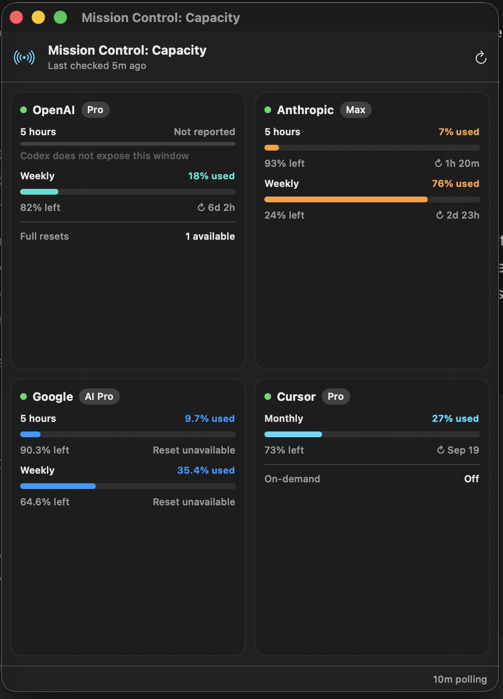

# Mission Control: Capacity

A native macOS dashboard for seeing subscription capacity across several AI coding providers in one place.



Mission Control: Capacity runs entirely on your Mac. It asks the provider CLIs you already use for their current quota information, displays the results in a menu-bar popover and dashboard window, and clearly marks cached measurements as stale when a refresh fails.

## Requirements

- macOS 13 or newer
- A Swift 6.2-compatible Xcode or Swift toolchain
- [`tmux`](https://formulae.brew.sh/formula/tmux)
- At least one supported provider CLI, installed and signed in

Install `tmux` with Homebrew:

```bash
brew install tmux
```

Providers whose CLIs are missing or signed out remain visible as unavailable; they do not prevent the other providers from refreshing.

## Install from source

```bash
git clone https://github.com/m4thnerd/mission_control_capacity.git
cd mission_control_capacity
./scripts/build-app.sh
open ".build/Mission Control Capacity.app"
```

The generated application is ad-hoc signed for the Mac that builds it. You can move `Mission Control Capacity.app` from `.build` into your Applications folder after building.

## Supported providers

- OpenAI via the structured Codex app-server rate-limit method.
- Anthropic via `claude auth status --json` and Claude Code's local `/usage` view.
- Google via Antigravity (`agy`) and its local `/usage` view.
- Cursor via `agent status --format json` and Cursor Agent's local `/usage` view.
- xAI is represented as an optional, not-yet-configured provider. Grok consumed through Cursor remains Cursor usage.

The app never reads or stores raw credentials. It asks each already-authenticated local CLI for the same usage information that the CLI displays to the user.

Interactive usage screens are captured in private, short-lived `tmux` sessions with unique `mcc-…` names. The app closes only the session it created and never touches an existing user session.

## Verify live adapters

```bash
swift run capacityctl
```

For machine-readable output:

```bash
swift run capacityctl --json
```

## Development

Run the app without creating a bundle:

```bash
swift run MissionControlCapacity
```

Build a menu-bar app bundle:

```bash
./scripts/build-app.sh
open ".build/Mission Control Capacity.app"
```

The bundle uses `LSUIElement`, so it appears in the menu bar without occupying the Dock. Clicking **Open Dashboard** opens a persistent window. Provider data polls in the background every 10 minutes and is stored locally in `~/Library/Application Support/Mission Control Capacity/capacity-snapshot.json`, so reopening the widget is instant. Failed providers retry after one minute. Their last good measurements remain visible but are explicitly marked stale; the refresh button still forces an immediate poll.

## Notes

- Cursor currently reports a monthly reset date without an exact time. The UI preserves that date instead of fabricating an hour-level countdown.
- Antigravity may report a quota as fully available without a reset timestamp. The UI treats that as a window that has not started.
- Vendor terminal output can evolve. The included `capacityctl` diagnostic exercises the current formats, and unrecognized output appears as a visible provider error rather than stale capacity.
- These are unofficial integrations and are not endorsed by the listed providers.
